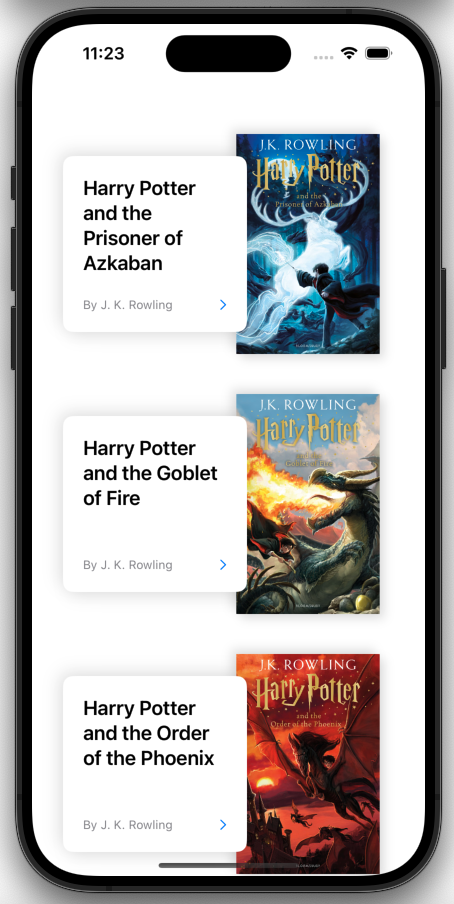
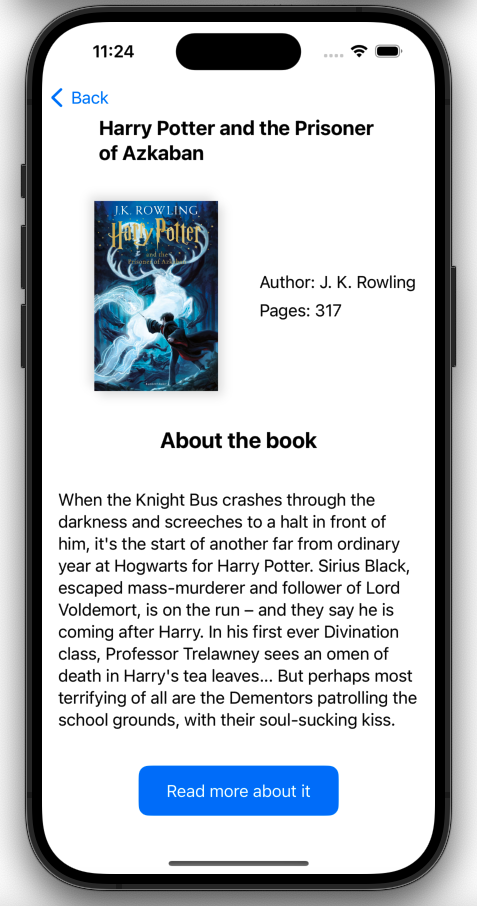
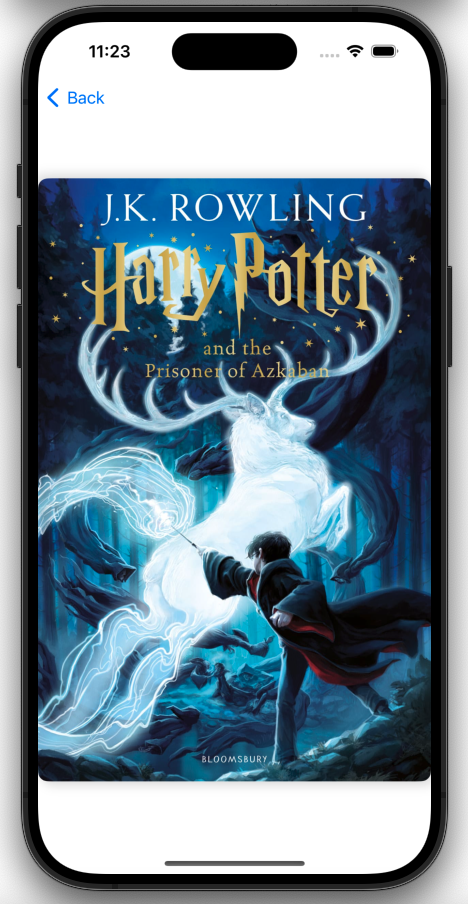

# Harry Potter Books

The Harry Potter Books App is a Swift-based application built with SwiftUI and Core Data. This app allows users to explore and discover information about various Harry Potter books, including titles, summary, and cover images. It leverages JSON parsing for fetching book data from an API, persistent storage with Core Data for offline access, and SwiftUI for a modern and intuitive user interface.

## Features

- **API Integration**: Fetches book information from an online API using URLSession.
- **JSON Parsing**: Parses the fetched JSON data into Swift models for easy manipulation.
- **Core Data Storage**: Stores book information locally using Core Data, enabling offline access and seamless data synchronization.
- **SwiftUI Interface**: Presents book details in a visually appealing and user-friendly interface designed with SwiftUI.
- **Cover Image Display**: Displays book covers fetched from the API using AsyncImage, enhancing the user experience with visual representations of the books.
- **Navigation**: Allows users to navigate between different views to explore detailed information about each book.

## Technologies Used

- Swift
- SwiftUI
- Core Data
- JSON Parsing
- URLSession
- AsyncImage

## Screenshots

  
   
   

