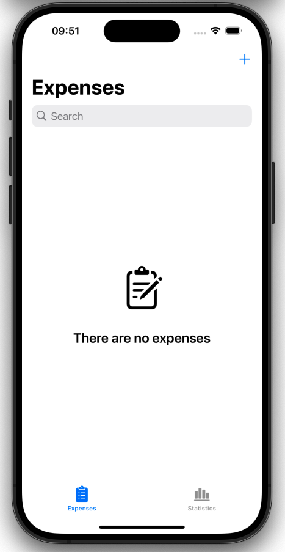
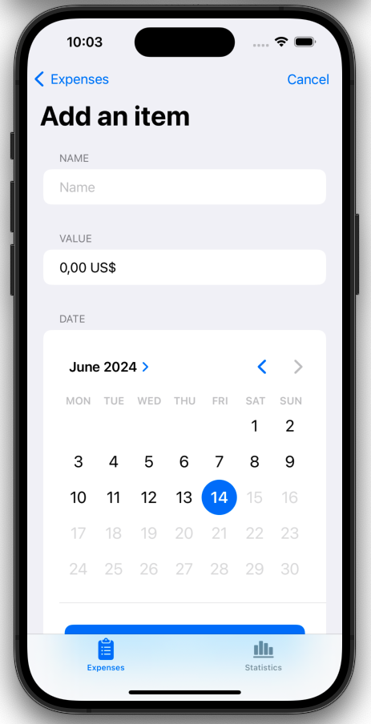
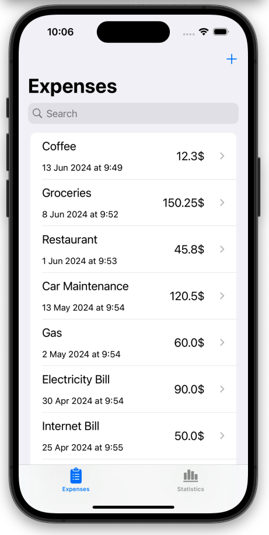
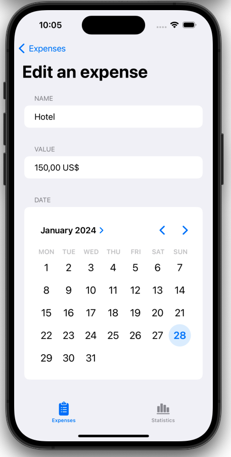
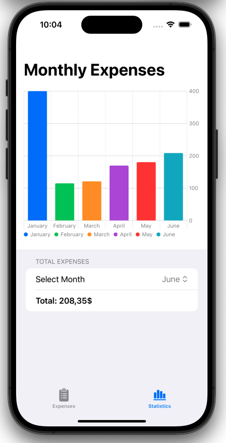

# Expenses

The Expenses App is a Swift-based application built with SwiftUI and SwiftData. This app allows users to manage their expenses through various functionalities such as adding, editing, and deleting expenses. It also provides visual insights into monthly expenses using interactive charts.

## Features

- **CRUD Operations**: Manage expenses with add, edit, delete, and view functionalities, utilizing SwiftData for persistent storage.
- **Monthly Expense Tracking**: Select a month to view the total expenses for that month.
- **Interactive Charts**: Visualize monthly expenses with dynamic bar charts.
- **Search Functionality**: Search for expenses by name to quickly find specific entries.
- **Modern UI**: Enjoy a sleek, intuitive user interface designed with SwiftUI.

## Technologies Used

- Swift
- SwiftUI
- SwiftData
- Charts

## Screenshots

  
   
   
   
   

