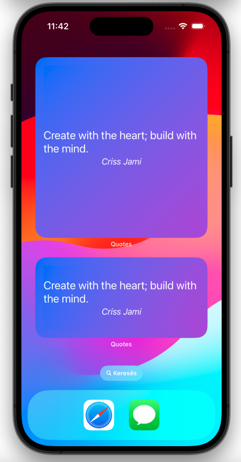
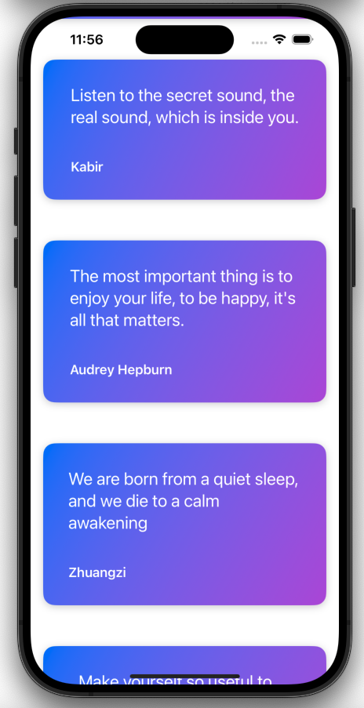

# Quotes Widget App

A Quotes Widget App built using Swift, SwiftUI, and Core Data. This app fetches quotes from an API, stores them locally, and displays them at regular intervals through widgets, showcasing JSON parsing, persistent storage, and widget integration.

## Features

- **API Integration**: Fetch quotes from an online API using URLSession.
- **JSON Parsing**: Parse the fetched JSON data into usable Swift models.
- **Core Data Storage**: Save parsed quotes into Core Data for persistent storage.
- **SwiftUI Widgets**: Display quotes on the home screen using SwiftUI widgets.
- **Regular Updates**: Quotes are updated at predefined intervals to keep the content fresh.

## Technologies Used

- Swift
- SwiftUI
- Core Data
- JSON Parsing
- URLSession
- WidgetKit

## Screenshots

  
   

