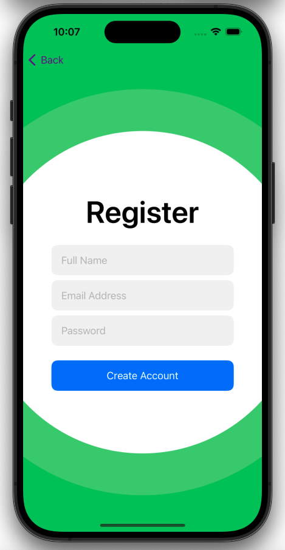
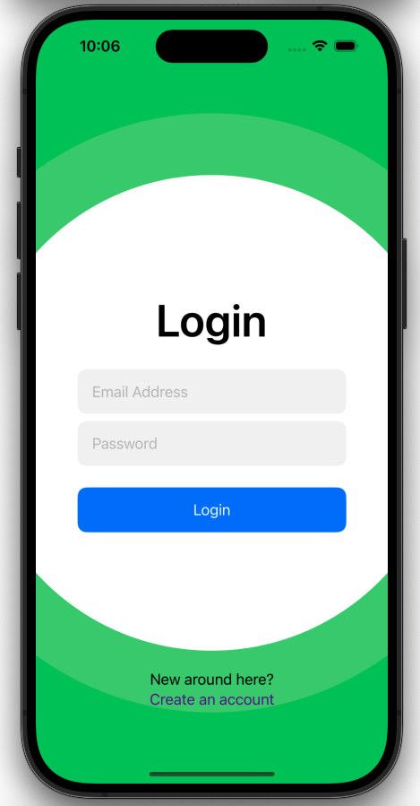
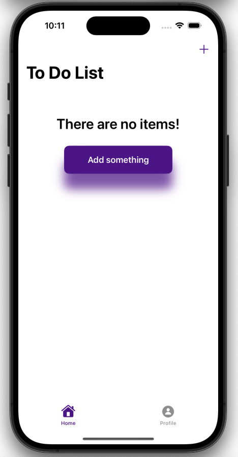
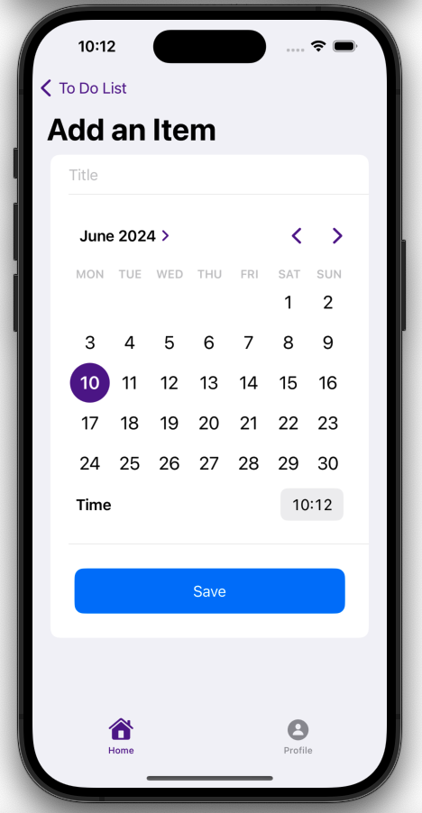
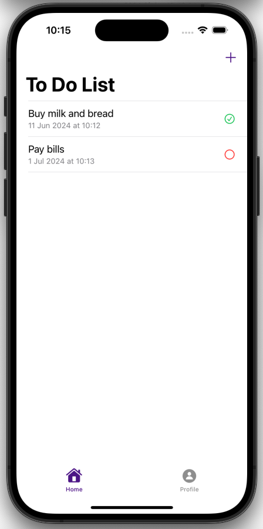
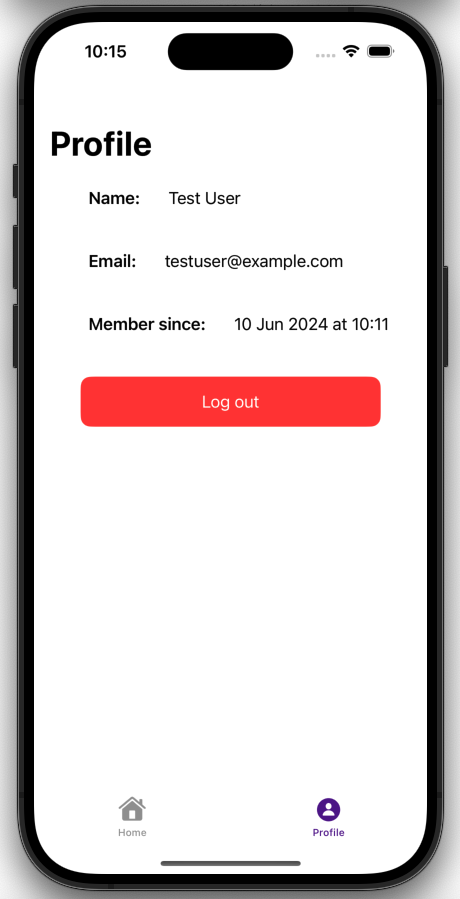

# To Do App

A To Do App built using Swift, SwiftUI, and Firebase. This app allows users to register, log in, manage their to-do list items, and handle their profile, showcasing authentication and real-time database capabilities.

## Features

- **User Registration and Login**: Secure user authentication using Firebase Authentication.
- **To-Do List Management**: Add and delete to-do list items stored in Firebase Firestore.
- **Profile Management**: View profile information and log out from the app.
- **Architecture**: Implements the MVVM (Model-View-ViewModel) architecture for a clean and maintainable codebase.

## Technologies Used

- Swift
- SwiftUI
- Firebase
  - Firebase Authentication: For secure user sign-up and sign-in.
  - Firebase Firestore: For real-time database operations.
- MVVM Architecture

## Screenshots

  
   
  
  
  
  

